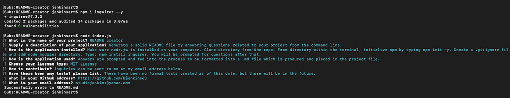
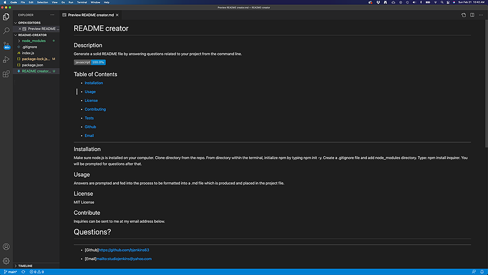

# README creator

## Description
Generate a solid README file by answering questions related to your project from the command line.

## Table of Contents

* [Installation](#installation)

* [Usage](#usage)

* [License](#license)

* [Contributing](#contributing)

* [Contact](#contact)

-----------

## Installation
Make sure node.js is installed on your computer. Clone directory from the repo. From directory within the terminal, initialize npm by typing npm init -y. Create a .gitignore file and add node_modules to the list directory. Type: npm install inquirer. You will be prompted for questions after that.

_________

## Screenshots

**Above:**  *This shot displays how the questions are presented and answered.*

**Below:** *This is the finished product, plaed into the project folder as a .md file.*

_________

_________
## Instruction Video

* https://drive.google.com/file/d/1qgP3KvQW8N9xV1t-nfGh5ZIjmoNt4lzv/view?usp=sharing

_________

## Usage
Answers are prompted and fed into the process to be formatted into a .md file which is produced and placed in the project file.

_________

## License
MIT License - 
_________

## Contributing
Inquiries can be sent to me at my email address below.

# Contact
*********

* Github[Github]https://github.com/bjenkins63

* Email[Email]mailto:studiojenkins@yahoo.com